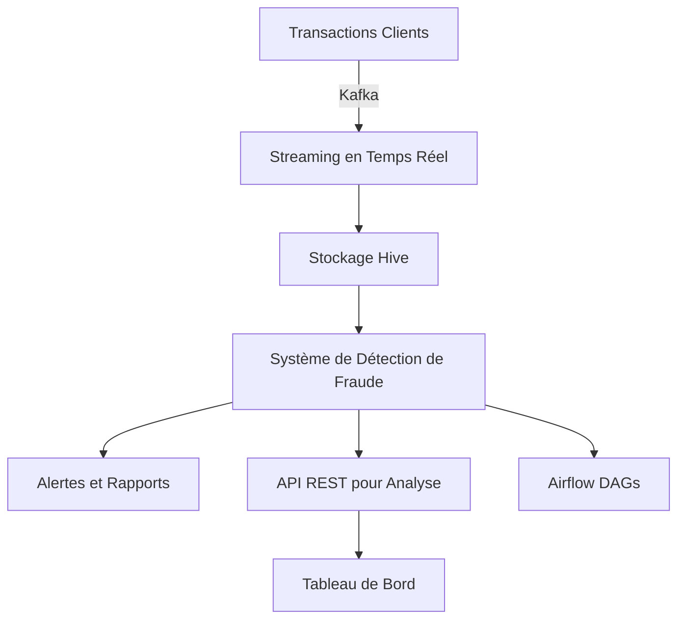

# 🚀 Système de Détection de Fraude en Quasi Temps Réel

## 📌 Description
Ce projet vise à détecter en quasi temps réel les activités suspectes et à minimiser les fausses alertes grâce à un système de collecte, stockage et analyse des transactions en temps réel.

## 🛠️ Technologies Utilisées
- **Kafka** : Ingestion des transactions en temps réel
- **Hive** : Stockage et gestion des données
- **Airflow** : Orchestration des workflows
- **GitHub Actions** : CI/CD pour automatiser les déploiements
- **Python / Flask** : Développement des API

## 📡 Architecture


## 🔥 Fonctionnalités
### 1️⃣ **Développement des API**
- **API des Transactions** (`/api/transactions`) : Exposition des données transactionnelles.
- **API des Clients** (`/api/customers`) : Accès aux informations des clients.
- **API des Données Externes** (`/api/externalData`) : Récupération de données externes (listes noires, scores de crédit, etc.).

### 2️⃣ **Collecte et Intégration des Données**
- Utilisation de Kafka pour ingérer les transactions en quasi temps réel.
- Nettoyage et transformation des données pour l'analyse.

### 3️⃣ **Stockage et Gestion des Données avec Hive**
- Création des tables Hive pour stocker les transactions, clients et données externes.
- Utilisation de partitionnement et bucketting pour améliorer les performances.

### 4️⃣ **Système de Détection de Fraude Basé sur les Règles**
- Règles d'alerte basées sur HiveQL :
  - Transactions anormalement élevées.
  - Fréquence de transactions trop élevée.
  - Transactions à partir de lieux inhabituels.
  - Transactions avec des clients sur liste noire.

### 5️⃣ **Déploiement et Orchestration**
- Airflow DAG pour automatiser le pipeline de collecte, traitement et alerte.
- Intégration de GitHub Actions pour CI/CD des scripts et DAGs.

## 🚀 Installation et Lancement
### 1️⃣ Prérequis
- Docker & Docker Compose
- Kafka & Zookeeper
- Hive & Hadoop
- Airflow

### 2️⃣ Lancer les Services
```sh
# Démarrer Kafka et Zookeeper
docker-compose up -d kafka zookeeper

# Démarrer Hive et Hadoop
docker-compose up -d hive metastore

# Démarrer Airflow
airflow standalone
```

### 3️⃣ Exécuter le Projet
```sh
# Cloner le projet
git clone https://github.com/votre-repo/fraud-detection.git
cd fraud-detection

# Installer les dépendances
pip install -r requirements.txt

# Lancer l'API
python app.py
```


---
👨‍💻 **Développé par RABII ZAHNOUNE**
